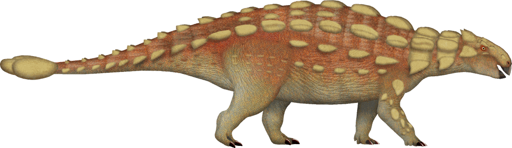

# Her birthday book

A book you page through, sitting in front of an animated landscape. Ten pages: a
cover, two pages of letter, six photos, and a closing page. You turn them by clicking
the page, using the arrows underneath, swiping on a phone, or pressing the left and
right arrow keys.

Everything lives in `index.html`. Nothing to install, no build step.

---

## 1. Fill in your parts

Open `index.html` in VS Code and press **Ctrl+F** (**Cmd+F** on Mac). Search for:

```
{{
```

Every spot you need to change is wrapped in double braces. Replace the whole thing,
braces included.

| Page | What to put |
|---|---|
| `<title>` at the top | Her name |
| 1 — cover | Her name, and a short line or the date underneath |
| 2 and 3 — the letter | Your letter |
| 4 to 9 — photos | Six captions |
| 10 — the last page | A closing line and your name |

### The letter

Page 2 starts at the comment `✏️ YOUR LETTER STARTS HERE`. Replace the placeholder
paragraphs with your own, keeping each one in its own tags:

```html
<p>Your first paragraph.</p>
<p>Your second paragraph.</p>
```

Page 3 is the rest of the letter and the signature. If your letter runs long the page
will scroll, but it reads better split across pages. To add another letter page, copy an
entire `<div class="leaf"> … </div>` block and paste it after page 3.

If you only need one page of letter, delete the whole page 3 block instead.

---

## 2. Add the photos

1. Put your pictures in the `images` folder, next to `index.html`.
2. Name them `photo-1.jpg` through `photo-6.jpg`.

They'll appear. Until then each frame tells you which file it's waiting for, so you can
see at a glance what's still missing.

Different names or file types? Change the `src` on that line:

```html

```

Portrait pictures fit best — the frames are 4:5 — but anything works, since photos are
cropped to fill and centred.

**More or fewer than six?** Copy or delete a whole `<div class="leaf"> … </div>` block.
Then fix the `<p class="folio">` numbers so the page numbers still run in order.

---

## 2b. The dinosaur

`images/ankylosaurus.png` does three jobs: the emblem on the cover, the drawing on the
last page, and the four silhouettes walking the hills behind the book. Keep that file in
the `images` folder or all of them vanish.

The background copies are tinted to match how far away they are, using SVG filters near
the top of the file (`tintA` through `tintD`). The illustration's own colours only show
on the cover and the last page.

To use a different animal, save a transparent PNG over the top with the same filename.
If its proportions differ a lot from this one (it's about three and a half times wider
than it is tall), adjust the `width` and `height` on each `<image>` tag in the background
scene so it isn't stretched.

If this artwork came from Wikipedia or Wikimedia Commons, it's probably under a licence
that asks for the artist's name and the licence to be credited. Worth checking the file's
page before the site goes public — a line in the footer of the last page covers it.

---

## 2c. Swapping any of the graphics

### First, get the picture ready

1. **It must be a PNG with a transparent background.** A JPG, or a PNG saved on white,
   will show up as a rectangle. If yours has a white background, run it through a
   background remover (remove.bg and PhotoRoom both have free web versions) and download
   the transparent PNG.
2. **Crop off the empty space** around the subject, so the edges of the file are the
   edges of the thing.
3. **Shrink it.** Anything over about 1500px wide is wasted on a web page. Aim to keep
   each file under ~200 KB or the site gets slow to load on a phone.
4. Drop it in the `images` folder.

### There are two kinds of graphic in the file

**Pictures on a page** — the one on the cover and the one on the last page. These are
ordinary HTML, so you only change the filename:

```html

```

Their size is set in the stylesheet by `.crest` and `.closing .doodle`. Change the
middle number in `clamp(160px, 66%, 270px)` to make one bigger or smaller.

**Things in the landscape** — the dinosaurs, the trees, the ferns. These live inside the
big `<svg class="scene">` block and use `<image>` rather than ``. There's a map of
the landscape's coordinates in a comment right above it.

### Replacing a tree, a plant or a dinosaur

Everything in the landscape is now a single line inside the `<svg class="scene">` block:

```html
<image href="images/tree.png" x="588" y="558" width="80" height="98" filter="url(#tintD)"/>
```

To change one, point `href` at your own file and redo the four numbers. The catch is that
`x` and `y` are the **top-left corner of the picture**, not the base. So to stand
something with its feet at ground point (X, Y):

```
x = X - width/2          y = Y - height
```

Pick a height that looks right first, then set the width to keep your picture's own
proportions. A 600 x 750px photo used at `height="100"` needs `width="80"`.

The plants come in four groups, each on its own hill: the far treeline, the middle ridge,
the near ridge, and the grass at the very front. Delete a line to remove that plant, or
copy one and change the numbers to add another. The grass at the front sits inside an
extra `<g class="frond">` wrapper, which is what makes it sway.

### Making a new tint colour

The tints are `<filter>` blocks near the top of the scene:

```html
<filter id="tintD" color-interpolation-filters="sRGB">
  <feColorMatrix type="matrix" values="0 0 0 0 .04  0 0 0 0 .03  0 0 0 0 .07  0 0 0 1 0"/>
</filter>
```

The three numbers `.04 .03 .07` are red, green and blue as fractions of 1. To convert a
hex colour, divide each pair by 255: `#4A3060` becomes 74/255, 48/255, 96/255 — so
`.29`, `.19`, `.38`. Copy the whole block, give it a new `id`, and point at it with
`filter="url(#yourname)"`.

---

## 3. Look at it

Double-click `index.html` and it opens in your browser. Refresh after each save.

For a nicer loop in VS Code, install the **Live Server** extension, then right-click
`index.html` → *Open with Live Server*. It reloads as you type.

---

## 4. Put it online with GitHub Pages

Free, about five minutes.

1. Go to [github.com/new](https://github.com/new) and create a repository. Call it
   anything (`birthday`). Set it to **Public** — GitHub Pages needs that on free
   accounts. Don't add a README, you already have one.
2. On the new repo's page, click **uploading an existing file**.
3. Drag in `index.html`, `README.md`, and your whole `images` folder. Click
   **Commit changes**.
4. Go to **Settings** → **Pages**.
5. Under *Build and deployment*, set **Source** to `Deploy from a branch`, branch
   `main`, folder `/ (root)`. Click **Save**.
6. Wait a minute, refresh, and your link appears at the top:
   `https://yourusername.github.io/birthday/`

Send her the link.

> **Before you publish:** a public repo means anyone with the URL can read the letter
> and see the photos. If that bothers you, keep the repo private and drop the folder on
> [netlify.com/drop](https://app.netlify.com/drop) instead — it gives you an unlisted
> link without needing a GitHub account.

### If you'd rather use the terminal

```bash
cd path/to/this/folder
git init
git add .
git commit -m "birthday book"
git branch -M main
git remote add origin https://github.com/YOURNAME/birthday.git
git push -u origin main
```

Then do steps 4–6 above.

---

## 5. Optional tweaks

**Colours.** The `:root` block at the top of the `<style>` holds the sunset, the ridges,
the paper, the cover and the gold. Change a hex value there and it updates everywhere.

**Page size.** Also in `:root`: `--pw` is the page width and `--ph` the height. A second
set of values further down applies to screens wider than 760px.

**Turn speed.** `--turn:900ms`. Lower is snappier.

**Her name wraps oddly on the cover.** Lower the `3.6rem` in
`.cover-name{font-size:clamp(2rem, calc(var(--pw) * .155), 3.6rem)}`.

**Slow the dinosaurs down.** Each animal in the background has a `--cross` value
(`--cross:58s`). Bigger number, slower walk.

If she has "reduce motion" turned on in her accessibility settings, the background stops
moving and pages change instantly. Everything still reads normally.
